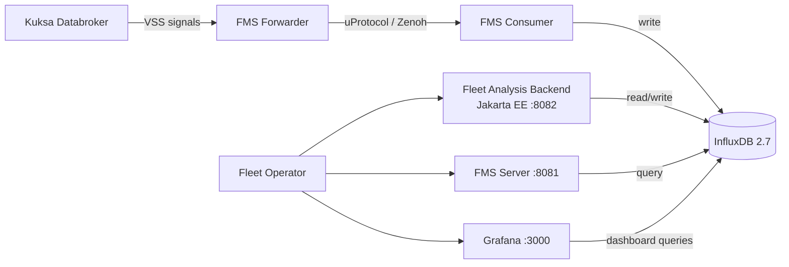

# Fleet Analysis Backend

The E2E demo includes a **Jakarta EE 11** backend service that provides fleet-level analytics on top of the telemetry stored by the Fleet Management Blueprint.

## Overview

The fleet analysis backend runs alongside the Fleet Management stack and connects to the same InfluxDB instance. It provides REST APIs for:

- Computing summary statistics from vehicle telemetry snapshots
- Ingesting telemetry data into InfluxDB
- Reading periodically refreshed fleet statistics

## Architecture



## API Endpoints

### `POST /api/analysis/summary`

Accepts a JSON array of vehicle snapshots and returns computed summary statistics.

**Request body:**

```json
[
  { "vehicleId": "truck-01", "speedKph": 85.2, "batterySoc": 72.5, "braking": false },
  { "vehicleId": "truck-02", "speedKph": 60.0, "batterySoc": 45.0, "braking": true }
]
```

**Response:**

```json
{
  "vehicleCount": 2,
  "averageSpeedKph": 72.6,
  "minBatterySoc": 45.0,
  "maxBatterySoc": 72.5,
  "brakingVehicles": 1
}
```

### `POST /api/telemetry/ingest`

Writes header and/or snapshot measurements into InfluxDB. Used for ingesting telemetry data from external sources.

### `GET /api/analysis/stats`

Returns the latest fleet statistics snapshot from InfluxDB, periodically refreshed (default: every 30 seconds).

**Response:**

```json
{
  "vehicleCount": 5,
  "headerCount": 120,
  "snapshotCount": 480,
  "totalCount": 600,
  "generatedAt": "2025-01-15T10:30:00Z"
}
```

## Configuration

The service is configured via environment variables:

| Variable | Default | Description |
| --- | --- | --- |
| `INFLUXDB_URI` | `http://influxdb:8086` | InfluxDB connection URI |
| `INFLUXDB_ORG` | `sdv` | InfluxDB organization |
| `INFLUXDB_BUCKET` | `demo` | InfluxDB bucket |
| `INFLUXDB_TOKEN` | — | InfluxDB authentication token |
| `INFLUXDB_TOKEN_FILE` | — | Path to token file (alternative to `INFLUXDB_TOKEN`) |
| `INFLUXDB_STATS_INTERVAL_SECONDS` | `30` | Interval for refreshing fleet statistics |

## Build and Run

### Build with Maven

```bash
cd devices/backend-fleet-analysis-java
mvn package
```

### Run Standalone (Payara Micro)

```bash
java -jar payara-micro.jar \
  --deploy target/fleet-analysis-backend.war \
  --contextRoot /fleet-analysis
```

The API will be available at `http://localhost:8080/fleet-analysis/api`.

### Build Docker Image

```bash
docker build -t fleet-analysis-backend:local devices/backend-fleet-analysis-java
```

### Run with Docker Compose (Recommended)

The service is included in the Fleet Management Docker Compose stack. Start from the repository root:

```bash
docker compose \
  -f external/fleet-management/fms-blueprint-compose.yaml \
  -f external/fleet-management/fms-blueprint-compose-zenoh.yaml \
  up --detach
```

The analytics service will be available at `http://<host>:8082/fleet-analysis/api`.

## Integration with Fleet Management

The fleet analysis backend integrates with the upstream Fleet Management Blueprint:

- **Data source**: Reads from the same InfluxDB instance where the FMS Consumer writes vehicle telemetry
- **Network**: Joins the `fms-backend` Docker network
- **Token sharing**: Uses the same InfluxDB token created by the Influx init job (mounted via `INFLUXDB_TOKEN_FILE`)
- **RFID driver identification**: The `Vehicle.Driver.Identifier.Subject` signal from the RFID door ECU is forwarded by the FMS Forwarder as the `driver1Id` field in the `header` measurement, visible in the Grafana "Driver Identifier (RFID)" panel
